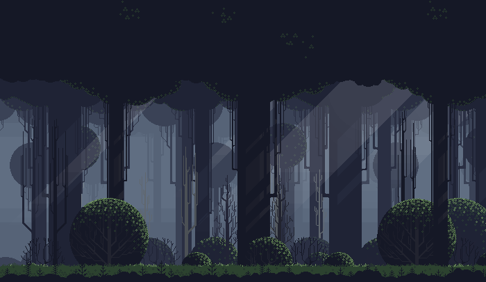
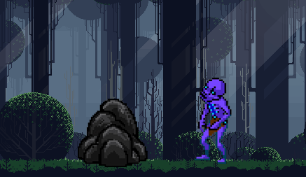

# Game Treatment  

## High Concept  
Traverse through the dark forest while hiding from monsters. 
If they spot you, run until they can't see you anymore, then stay out of sight.

## Genre  
Horror  
Puzzle  
Sidescroller  

## Platform  
The game is currently planned as desktop only, but mobile-friendly controls will be included if there is enough time.  

## Story  
The player controls a little girl who got lost in the woods and is trying to find her way home.
The forest is full of terrifying monsters, so the girl needs to hide from them while making her way home.

## Aesthetics  
Graphics: Simple 8-bit or cartoon sprites  
Sound: Ambient noise, enemy sounds, heartbeats when enemies chase you  

## Gameplay  
### Mechanics  
Stay out of monsters' line of sight by hiding behind things like trees or rocks.
If they do spot you, keep running until they can't see you, then hide to get 
them to stop chasing you.  
### Controls
Arrow keys or WASD to move, space to hide behind objects  
### Onboarding
The game's instructions will be beside or underneath the game on the web page.
### Player Learning  
The player needs to learn to when it is safe to continue, and when they should hide.
The game will become harder as they progress, so learning how to move safely will be crucial.  

## Screenshots  
### Background  
  
### Hiding From Enemies  

## Other  

## About  
Name: Triton Adamski  
Major: Game Design and Development  
Year: Sophomore  
Skills and Interests: Programming, Physics, Maya, Music, Art  

